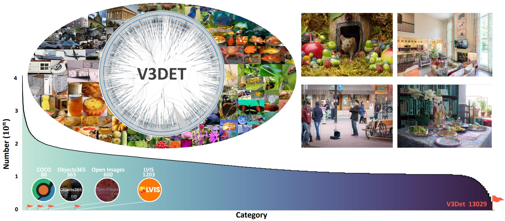

#  V3Det: Vast Vocabulary Visual Detection Dataset (ICCV 2023)

> V3Det: Vast Vocabulary Visual Detection Dataset (ICCV 2023) [[Paper](https://arxiv.org/abs/2304.03752), [Dataset](https://v3det.openxlab.org.cn/)]   
> [Jiaqi Wang](https://myownskyw7.github.io/), [Pan Zhang](https://panzhang0212.github.io/), Tao Chu, Yuhang Cao, Yujie Zhou, [Tong Wu](https://wutong16.github.io/), Bin Wang, Conghui He, [Dahua Lin](http://dahua.site/)    

<p align="left">
    
</p>


<!-- [ALGORITHM] -->

## Abstract

Recent advances in detecting arbitrary objects in the real world are trained and evaluated on object detection datasets with a relatively restricted vocabulary. To facilitate the development of more general visual object detection, we propose V3Det, a vast vocabulary visual detection dataset with precisely annotated bounding boxes on massive images. V3Det has several appealing properties: 1) Vast Vocabulary: It contains bounding boxes of objects from 13,029 categories on real-world images, which is 10 times larger than the existing large vocabulary object detection dataset, e.g., LVIS. 2) Hierarchical Category Organization: The vast vocabulary of V3Det is organized by a hierarchical category tree which annotates the inclusion relationship among categories, encouraging the exploration of category relationships in vast and open vocabulary object detection. 3) Rich Annotations: V3Det comprises precisely annotated objects in 245k images and professional descriptions of each category written by human experts and a powerful chatbot. By offering a vast exploration space, V3Det enables extensive benchmarks on both vast and open vocabulary object detection, leading to new observations, practices, and insights for future research. It has the potential to serve as a cornerstone dataset for developing more general visual perception systems.


## Prepare Dataset

Please download and prepare V3Det Dataset at [V3Det Homepage](https://v3det.openxlab.org.cn/) and [V3Det Github](https://github.com/V3Det/V3Det).

The data includes a training set, a validation set, comprising 13,204 categories. The training set consists of 183,354 images, while the validation set has 29,821 images. The data organization is:

```
data/
    images/
        <category_node>/
            |────<image_name>.png
            ...
        ...
    annotations/
        |────v3det_2023_v1_category_tree.json       # Category tree
        |────category_name_13204_v3det_2023_v1.txt  # Category name
        |────v3det_2023_v1_train.json               # Train set
        |────v3det_2023_v1_val.json                 # Validation set
```


## Training
Please follow the [EVA](https://github.com/baaivision/EVA/tree/master/EVA-01/det) to build the Detectron2.

Slurm training on 4 nodes (32 A100):
````bash
srun -p cluster --cpus-per-task=112 --gres=gpu:8 --ntasks=4 --ntasks-per-node=1 --job-name=eva1280 multi-4node_run.sh --config-file projects/ViTDet/configs/V3Det/cascade_mask_rcnn_vitdet_eva_1280.py "train.init_checkpoint=eva_o365.pth" "train.output_dir=output2/v3det1280"
````

evaluation on 8 A100:
````bash
python tools/lazyconfig_train_net.py --num-gpus 8 --eval-only --config-file projects/ViTDet/configs/V3Det/cascade_mask_rcnn_vitdet_eva_1536.py "dataloader.evaluator.output_dir=output2/v3det1280_eval" "train.init_checkpoint=output2/v3det1280/model_final.pth"
````


## Results and Models

| Backbone |      Model      | Lr schd | box AP |                                     Config                                     |                                                          Download                                                           |
|:--------:| :-------------: | :-----: |:------:|:------------------------------------------------------------------------------:| :-------------------------------------------------------------------------------------------------------------------------: |
|   EVA    |  Cascade R-CNN   |   2x    |  49.4  | [config](./projects/ViTDet/configs/V3Det/cascade_mask_rcnn_vitdet_eva_1536.py) |  [model](https://download.openxlab.org.cn/models/V3Det/V3Det/weight/eva_1280)   |


## Citation

```latex
@article{wang2023v3det,
  title={V3det: Vast vocabulary visual detection dataset},
  author={Wang, Jiaqi and Zhang, Pan and Chu, Tao and Cao, Yuhang and Zhou, Yujie and Wu, Tong and Wang, Bin and He, Conghui and Lin, Dahua},
  journal={arXiv preprint arXiv:2304.03752},
  year={2023}
}
```
